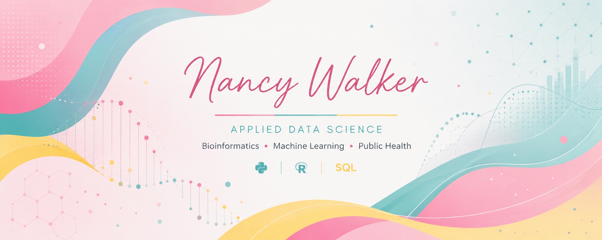

--------------------------------------------------------

  

--------------------------------------------------------

## Hi there 👋 I'm Nancy Walker

I'm a former Research & Development Scientist with a background in Biology and Public Health, currently pursuing an M.S. in Applied Data Science at the University of San Diego. My interests lie at the intersection of machine learning, healthcare, and bioinformatics, where I enjoy building data-driven solutions to support research and public health decision-making.

🎓 M.S. Applied Data Science Candidate | University of San Diego

🧬 Biology + Public Health Background

💻 Aspiring Bioinformatics & Biostatistics Data Scientist focused on applying machine learning to genomics and healthcare.

---

## 🔬 Current Interests

- Genomics
- Cancer Bioinformatics
- Survival Analysis
- Predictive Modeling
- AI for Healthcare

---

## 💻 Languages

---

## 📚 Libraries

---

## 🛠️ Tools

---

## 🚀 Currently Working On

- 🩺 Hypertension Risk Atlas (Capstone)

---

## 🌱 Currently Learning

- Bioinformatics workflows
- Survival analysis
- Streamlit deployment
- Advanced R for genomics

---

## 📂 Featured Projects

### 🩺 Hypertension Risk Atlas
*Python • Streamlit • Machine Learning • Public Health*

Interactive dashboard for exploring hypertension risk and social determinants of health.

🔗 [Repository](https://github.com/xuany823/ADS599_Capstone_Hypertension_Risk_Atlas)

---

### 💊 Drug Review Insights & Summarization Tool
*Python • LLMs • NLP • Streamlit*

AI-powered application that summarizes patient drug reviews into actionable insights for healthcare professionals.

🔗 [Repository](https://github.com/mvillanueva00/ADS-509-Final-Project)

---

### 🥗 NutriAccess Food Environment Analysis

*Python • Data Engineering • Public Health*

Data science pipeline designed to analyze food access, socioeconomic conditions, and health indicators to identify communities at risk of limited access to healthy food.

🔗 [Repository](https://github.com/ngwalker93/ADS508Group3)

---

## Connect with me

<!--
**ngwalker93/ngwalker93** is a ✨ _special_ ✨ repository because its `README.md` (this file) appears on your GitHub profile.

Here are some ideas to get you started:

- 🔭 I’m currently working on ...
- 🌱 I’m currently learning ...
- 👯 I’m looking to collaborate on ...
- 🤔 I’m looking for help with ...
- 💬 Ask me about ...
- 📫 How to reach me: ...
- 😄 Pronouns: ...
- ⚡ Fun fact: ...
-->
